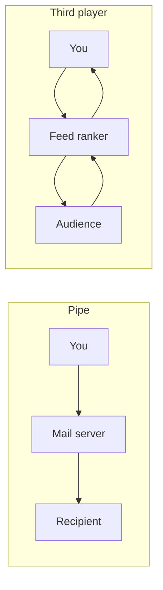

# Algorithmacy Coach

## The problem

People reach audiences, riders, and customers through apps they do not control. An algorithm sits in the middle. They rarely learn whether that algorithm is just passing things along, or whether it binds everyone into one knot, and they get no reading on whether they are steering.

## The research idea

Roger Hunt's open lab, algorithmacy-lab, asks a plain question. When you, a system between you, and someone on the other side coordinate, does the arrangement stay in one piece, or does it fall apart into separate pairs?

If it falls apart, the lab calls it dyadic. Ordinary literacy is enough. If it stays irreducible across all three, the lab calls it triadic, and the skill it asks for is algorithmacy. The number is exact integrated information, Φ, from IIT 4.0, computed with PyPhi. The lab writes its guesses down before it computes, and it reports the guesses that fail. The results are about small logical models, not about real companies. The lab is MIT licensed and is asking people to bring real cases.

Email is the pipe in this app: the sender holds its own state, the server copies the sender, and the recipient copies the server. Instagram's base is the loop: the ranker reads both sides, and both sides read the ranker.

## Riya and Sam

Both open Instagram. Their scores use all six answers. The tangle uses only whether they adapt and whether they keep another channel.

Riya answers 0, 0, 0, 0, 1, 0. She does not adapt and has no other channel. There is no tangle for her: she does not react to the ranker, so for her it passes things along. Her coach score is 1/12, Passive. The tips point at noticing and reacting on purpose.

Sam answers 2, 2, 2, 2, 1, 2. He adapts and keeps another channel. He is in the game and steering it. The whole system stays triadic, and the tightest core is you and the ranker. His coach score is 11/12, Deliberate.

The what-if panel lets either of them flip those two habits and watch the triangle, the verdict, and Φ change. The score does not move.

## What the math found

In a simplified three-party model, two results are easy to miss.

On Uber, adapting without another channel leaves a real tangle whose tightest core is dispatch and the rider. The driver is outside it.

On Instagram, keeping another way to reach the audience shrinks that core. The audience falls out. You and the ranker remain.

Both numbers are read from `phi_results.json`. They are about the models.

## What is computed, and what is a rubric

| | Computed | Rubric |
|---|---|---|
| Question | Does this model stay in one piece, and who is in the tightest core? | How deliberately does this person navigate? |
| Method | Exact Φ, IIT 4.0, via algorithmacy-lab | Six questions, 0–2 each, total 0–12 |
| Changes when | The rules change and the precompute is rerun | The person answers differently |

## What's next

Voice input. A live PyPhi service for models that are not in the file. A way to describe any app and have Grok draft the rules. A comparison with the lab's survey once it is fielded. Logs offered back to the lab's call for real-world data.

The longer version, with the pipeline and the twelve results, is the case study at `/about`.
