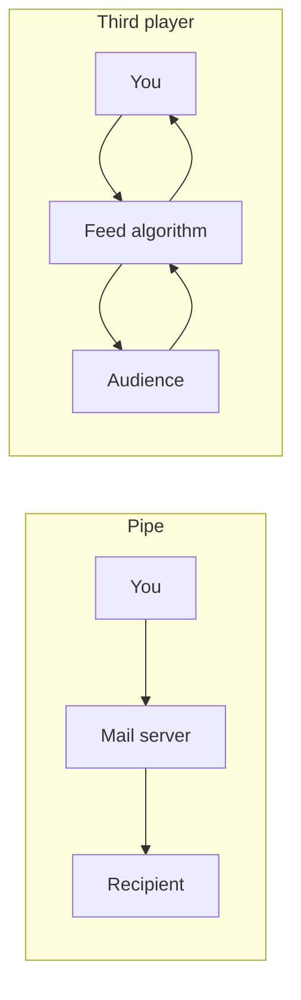

# Algorithmacy Coach

## The problem

People coordinate with audiences, riders, and customers through algorithms they cannot see. Most of them never ask whether the platform is a neutral pipe or an active party shaping both sides. They also get no feedback on how deliberately they navigate it.

## The research idea

Roger Hunt's algorithmacy lab treats a coordination as dyadic when it splits into independent two-party pieces, and triadic when it stays irreducible across the user, the algorithm, and the counterpart. The measure is exact integrated information, Φ, in the IIT 4.0 sense, computed with PyPhi. A dyad asks for ordinary literacy. A triad asks for algorithmacy: the skill of steering a coordination whose third party you do not control.

Email is the pipe. Its base rules are a forward-only chain, the case the lab's back-edge thread isolates: the sender holds its own state (`U' = U`), the server copies the sender (`A' = U`), and the recipient copies the server (`C' = A`). Nothing reads back. Instagram's base is the third player: the ranker updates from both sides (`A' = U AND C`), and both sides update from the ranker.

Two answers edit that base before Φ is read. If you do not adapt (question 4 scored 0), your node ignores the algorithm (`U' = U`). If you keep a real alternative (question 6 scored 2), a direct channel opens (`C' = (base C) OR U`). Question 6 is the lab's finding that a genuine substitute loosens a platform's hold, written into the model instead of only into the rubric.

## Riya and Sam

Both open Instagram. Their structural readings are different variants.

Riya answers 0, 0, 0, 0, 1, 0. She does not adapt and has no alternative, so the key is `instagram:false:false`. The classifier says dyadic, Φ 0.00. There is no tangle, so the card says Instagram acts like a pipe and does not mention membership. The coach score is 1/12, Passive.

Sam answers 2, 2, 2, 2, 1, 2. He adapts and keeps another channel, so the key is `instagram:true:true`. The whole-system classifier says triadic, Φ 0.42. The major complex is only U and A, so the card keeps "triadic", says he is part of the tangle, and names the core: you and the ranker. The coach score is 11/12, Deliberate.

The score uses all six answers. The tangle line uses Φ and major-complex membership together: you are part of the tangle only when Φ > 0 and U is in the major complex. Φ = 0 is a pipe, with no membership sentence.

## What is computed, and what is a rubric

| | Computed | Rubric |
|---|---|---|
| Question | Is the whole system irreducible, and is U in a tangle that exists? | How deliberately does this person navigate? |
| Method | Exact Φ, IIT 4.0, via algorithmacy-lab | Six questions, 0–2 each, total 0–12 |
| Changes when | The Boolean rules change and the precompute is rerun | The person answers differently |
| Riya | `instagram:false:false`, dyadic, Φ 0.00, a pipe | 1/12 Passive |
| Sam | `instagram:true:true`, triadic, Φ 0.42, core you and the ranker | 11/12 Deliberate |

Base models, then the twelve variants from `public/data/phi_results.json`:

The verdict column is the lab classifier on the whole system. The major complex is a separate reading. Φ below is rounded to two decimals, matching the card.

| Platform | U (user) | A (algorithm) | C (counterpart) | Rules | Verdict | Φ |
|---|---|---|---|---|---|---|
| Instagram | creator posts | feed ranker | audience | A'=U AND C; U'=A; C'=A | triadic | 2.00 |
| Uber | driver goes online | dispatch | rider | A'=U AND C; U'=A; C'=A AND U | triadic | 1.00 |
| Email (comparison) | sender | mail server | recipient | A'=U; C'=A; U'=U | dyadic | 0.00 |

| Key | Rules | Verdict | Φ | Major complex | Card |
|---|---|---|---|---|---|
| `instagram:false:false` | A'=U AND C; U'=U; C'=A | dyadic | 0.00 | A, C | There's no tangle here: Instagram acts like a pipe |
| `instagram:false:true` | A'=U AND C; U'=U; C'=(A) OR U | dyadic | 0.00 | U | There's no tangle here: Instagram acts like a pipe |
| `instagram:true:false` | A'=U AND C; U'=A; C'=A | triadic | 2.00 | U, A, C | You are part of the tangle |
| `instagram:true:true` | A'=U AND C; U'=A; C'=(A) OR U | triadic | 0.42 | U, A | You are part of the tangle. The core is you and the ranker. |
| `uber:false:false` | A'=U AND C; U'=U; C'=A AND U | dyadic | 0.00 | A, C | There's no tangle here: Uber acts like a pipe |
| `uber:false:true` | A'=U AND C; U'=U; C'=(A AND U) OR U | dyadic | 0.00 | U | There's no tangle here: Uber acts like a pipe |
| `uber:true:false` | A'=U AND C; U'=A; C'=A AND U | triadic | 1.00 | A, C | You sit outside the tangle. The core is the dispatch and the rider. |
| `uber:true:true` | A'=U AND C; U'=A; C'=(A AND U) OR U | triadic | 2.00 | U, A | You are part of the tangle. The core is you and the dispatch. |
| `email:false:false` | A'=U; U'=U; C'=A | dyadic | 0.00 | U | There's no tangle here: Email acts like a pipe |
| `email:false:true` | A'=U; U'=U; C'=(A) OR U | dyadic | 0.00 | U | There's no tangle here: Email acts like a pipe |
| `email:true:false` | A'=U; U'=U; C'=A | dyadic | 0.00 | U | There's no tangle here: Email acts like a pipe |
| `email:true:true` | A'=U; U'=U; C'=(A) OR U | dyadic | 0.00 | U | There's no tangle here: Email acts like a pipe |

`uber:true:false` stays the classifier's triadic label at Φ 1.00, and the core is dispatch and the rider, so you sit outside it. Email never leaves Φ 0.00. The card calls it a pipe and does not mention membership.

Grok writes the sentences on the results screen. It does not choose the score or the verdict. With no API key, the screen uses templated tips and looks the same.

## What is next

More platforms. A larger model for each one. A comparison of this rubric against the lab's survey instrument, once that instrument is published.
