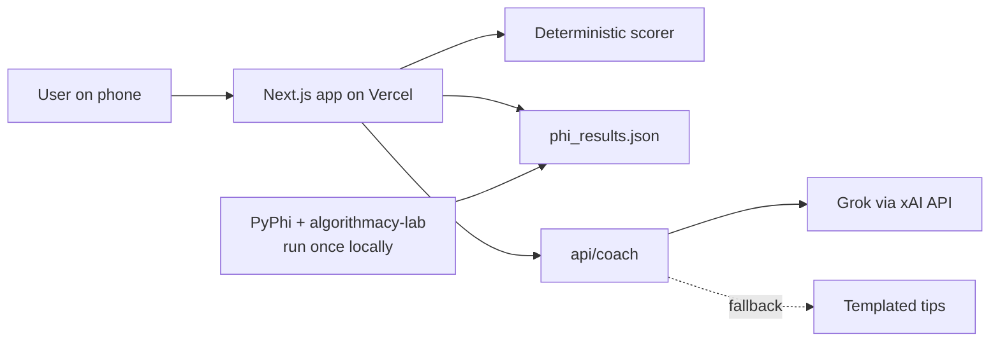
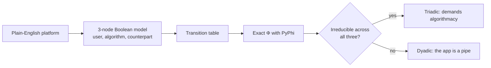
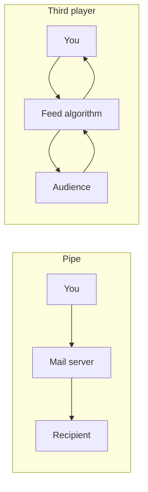

# Algorithmacy Coach — Build Plan

One file, everything needed. Drop it in the repo root as `PLAN.md`, then tell the Grok Bot in Cursor:

> Read PLAN.md completely. Execute Phases 1–6 in order. Stop only at steps marked **[USER]**, tell me exactly what to do, then continue. Do not ask me design questions; every decision is already in this file. Time-box each phase as written.

Total budget: 2 hours. Your hands-on time: about 15 minutes, all at **[USER]** steps.

---

## 0. Timeline at a glance

| Time | Phase | Who | Output |
|---|---|---|---|
| 0:00–0:10 | 0. Setup | You | Repo, keys, Cursor open, kickoff prompt sent |
| 0:10–0:30 | 1. Φ precompute | Bot | `public/data/phi_results.json` |
| 0:30–1:05 | 2. Coach app | Bot | Working `/coach` flow + `/api/coach` |
| 1:05–1:20 | 3. Pitch site | Bot | Landing page at `/` |
| 1:20–1:35 | 4. Deploy | Bot + you (login, env var) | Live Vercel URL |
| 1:35–1:50 | 5. Screenshots + docs | Bot | `README.md`, `OVERVIEW.md`, `docs/screenshots/` |
| 1:50–2:00 | 6. Demo rehearsal | You | Two-persona live demo |

If anything runs over, cut in this order: Email comparison platform → Vercel Analytics → OVERVIEW infographics beyond two diagrams. Never cut: the live link, the two demo personas, the honesty footer.

---

## 1. PRD

### 1.1 One-liner
Algorithmacy Coach tells you two things about an app you use: whether the app's algorithm is a real third player between you and the people on the other side, and whether you are steering that algorithm or it is steering you.

### 1.2 Problem
People coordinate with audiences, riders and customers through algorithms they cannot see. Most users never ask whether the platform is a neutral pipe or an active party shaping both sides, and they get no feedback on how deliberately they navigate it.

### 1.3 Grounding
Inspired by Roger Hunt's algorithmacy research and built on the open `algorithmacy-lab` repo (MIT license): https://github.com/rogerSuperBuilderAlpha/algorithmacy-lab

The lab's thesis: a coordination form is dyadic when it splits into independent two-party pieces (it demands literacy) and triadic when it stays irreducible across the worker–system–counterpart partition (it demands algorithmacy), measured with exact integrated information Φ (IIT 4.0, PyPhi).

The app splits that thesis into two readings:

| Reading | Question | Source |
|---|---|---|
| Structure (Triad Check) | Does this platform demand algorithmacy? | Φ computed with PyPhi on a small model of the platform |
| Competence (Coach score) | Do you have it? | Six-question prototype rubric |

### 1.4 Users
Primary: anyone who uses Instagram or drives for Uber. Secondary (today): hackathon attendees and the host, who will try it live.

### 1.5 Goals for today
1. Live public URL anyone can open on a phone.
2. A user finishes the flow in under 60 seconds.
3. Two preset personas produce clearly different results for the demo.
4. README and OVERVIEW explain the project with diagrams and real screenshots.

### 1.6 Non-goals
No accounts, no database, no saving answers, no validated psychometrics, no claims about real organizations.

### 1.7 User flow
1. Landing page `/` → "Try the coach" button.
2. `/coach` step 1: pick a platform (Instagram, Uber, Email comparison).
3. Steps 2–7: six questions, one per screen, three tappable answers each.
4. Results screen:
   - Triad Check card: verdict (Triadic or Dyadic), Φ value, one-sentence plain explanation, tiny diagram of the three parties.
   - Coach card: score out of 12, level (Passive / Aware / Deliberate), headline.
   - Three personal tips.
   - Buttons: "Try another platform", "Share my result" (copies text with the site link).
5. Persona shortcuts on `/coach`: "Try as Riya (passive)" and "Try as Sam (deliberate)" auto-fill answers and jump to results. These exist for the demo.

### 1.8 Success metrics
Live link works on mobile; demo runs end to end twice without error; page visits visible in Vercel Analytics (optional).

---

## 2. Requirements

### 2.1 Functional
- F1. Platform picker with three options, defined in `src/data/platforms.ts`.
- F2. Six questions, same for every platform, with platform-specific wording via a `{counterpart}` and `{app}` placeholder.
- F3. Deterministic scoring in code (Section 4). Score never depends on the LLM.
- F4. Triad Check reads the precomputed result for the chosen platform from `public/data/phi_results.json`. No Python runs in production.
- F5. `/api/coach` calls Grok for the headline, explanation and tips. Returns strict JSON.
- F6. Fallback: if the Grok call fails, times out (8 s) or no key is set, return templated tips from `src/data/fallbackTips.ts`. The UI must look identical either way.
- F7. Persona shortcuts (Section 1.7, step 5).
- F8. Share button copies: "I scored {level} ({score}/12) on {app} with Algorithmacy Coach: {url}".
- F9. Footer on every page with the honesty notes (Section 2.4).

### 2.2 Non-functional
- Mobile-first, works at 375 px width.
- Results render in under 3 s with Grok, instantly with fallback.
- No secrets in client code. `XAI_API_KEY` used only in the API route.
- Lighthouse performance above 85 on the landing page.

### 2.3 Tech stack (fixed)
- Next.js (App Router) + TypeScript + Tailwind CSS.
- Deployed on Vercel.
- Grok via the xAI API (OpenAI-compatible chat completions endpoint at `https://api.x.ai/v1`). Model name from env var `XAI_MODEL`; the bot checks https://docs.x.ai for the current model id and sets a sensible default.
- Precompute: Python 3.10+ with PyPhi from the `algorithmacy-lab` requirements, run once locally. Never deployed.
- Optional: `@vercel/analytics`.

### 2.4 Honesty notes (footer and README, verbatim)
- "Inspired by Roger Hunt's algorithmacy research. Structural verdicts are computed with PyPhi (IIT 4.0) via the open algorithmacy-lab repo, on simplified three-party models of each platform."
- "The coach score is a prototype rubric, not a validated measure."
- "Your answers are not stored."

---

## 3. Triad Check: the Φ precompute (Phase 1)

### 3.1 Models
Three nodes, binary states, one update rule each. U = user, A = the app's algorithm, C = counterpart. These are deliberately simple renderings; label them as such.

| Platform | U (user) | A (algorithm) | C (counterpart) | Rules |
|---|---|---|---|---|
| Instagram | creator posts | feed ranker | audience | A' = U AND C; U' = A; C' = A |
| Uber | driver goes online | dispatch | rider | A' = U AND C; U' = A; C' = A AND U |
| Email (comparison) | sender | mail server | recipient | A' = U; C' = A; U' = U |

Email is the contrast case: the server relays messages without combining both sides.

### 3.2 Procedure for the bot
1. Create `phi/`. Clone `algorithmacy-lab` into `phi/vendor/algorithmacy-lab` (shallow clone). Create a Python 3.10+ venv in `phi/.venv` and `pip install -r` the repo's `requirements.txt`.
2. Following the repo's own protocol, first run the repo's instrument control (the check registered with `"core": true` in `ci/reproduce.json`) and confirm it passes. Record the output.
3. Write `phi/precompute_phi.py`. Prefer the repo's helpers (`foundations/proxy_audit/exact_phi.py`, `org_frontier/classifier/`, `org_frontier/probes/lib.py`) over writing PyPhi calls from scratch. Use the repo's own definition of the dyadic/triadic verdict; do not invent one.
4. For each model, compute the state-by-node TPM from the rules, compute exact Φ for the whole three-node system (and the major complex if the helper provides it), and record the verdict.
5. Write `public/data/phi_results.json`:
   ```json
   {
     "computed_at": "ISO timestamp",
     "instrument": "PyPhi IIT-4.0 via algorithmacy-lab",
     "control_passed": true,
     "platforms": {
       "instagram": { "phi": 0.0, "verdict": "triadic|dyadic", "major_complex": ["U","A","C"], "rules": "A'=U AND C; U'=A; C'=A" }
     }
   }
   ```
6. Commit `phi/precompute_phi.py` and the JSON. Add `phi/vendor` and `phi/.venv` to `.gitignore`.

### 3.3 Rules
- Display whatever the computation returns. Never edit numbers by hand. If Email comes out triadic or Instagram dyadic, the app shows that and the explanation text adapts.
- Time-box: 20 minutes. If PyPhi will not install or run, set `"control_passed": false`, leave `phi` as `null`, and the Triad Check card shows "Structural verdict coming soon" with the model rules. Tell the user. Do not fake values.

---

## 4. Coach scoring

Six questions. Each answer scores 0 (passive), 1 (mixed) or 2 (deliberate). Total 0–12.

| # | Theme | 0 | 1 | 2 |
|---|---|---|---|---|
| 1 | Discovery | I just take what {app} shows me | A mix of feed and my own choices | I mostly search or go to things I picked |
| 2 | Understanding | No idea why things show up | A rough idea | I can name the signals it uses |
| 3 | Tuning | I never adjust anything | Sometimes | I regularly mute, hide or reset |
| 4 | Adapting | I never change how I act for it | Sometimes, without a plan | I test times, formats or zones on purpose |
| 5 | Noticing | I don't notice being steered | Occasionally | I notice and decide whether to go along |
| 6 | Alternatives | {app} is my only channel to {counterpart} | I use one other channel a bit | I keep real alternatives to reach {counterpart} |

Levels: 0–4 Passive, 5–8 Aware, 9–12 Deliberate.

Personas:
- Riya: answers 0,0,0,0,1,0 → 1/12 Passive on Instagram.
- Sam: answers 2,2,2,2,1,2 → 11/12 Deliberate on Instagram.

Question 6 echoes the lab's finding that a genuine substitute loosens a platform's hold; mention this in the OVERVIEW.

---

## 5. Grok integration

### 5.1 Route
`POST /api/coach` with body `{ platform, answers: number[6], score, level, triad: { verdict, phi } }`.

### 5.2 System prompt (use verbatim)
```
You are Algorithmacy Coach. Algorithmacy is the skill of navigating a coordination that runs through an algorithm you do not control. You receive a platform, a user's six rubric answers (0 passive, 1 mixed, 2 deliberate), their score and level, and a structural verdict for the platform (triadic means the algorithm is an irreducible third party between the user and the counterpart; dyadic means it acts like a pipe).
Reply with JSON only, no markdown, matching:
{"headline": string (max 12 words), "explanation": string (max 45 words, plain English, mention the verdict), "tips": [string, string, string] (each max 25 words, concrete actions for this platform, aimed at their weakest answers)}
Be warm and direct. No jargon beyond the word "algorithm". Never claim the score is a scientific measurement.
```

### 5.3 Handling
Parse defensively: strip code fences, `JSON.parse` in try/catch, validate shape, else fallback (F6). Timeout 8 s with `AbortController`.

### 5.4 Fallback tips
`src/data/fallbackTips.ts`: for each platform and each question, one tip for answers 0 and 1. Pick the three lowest-scoring questions.

---

## 6. Pitch site (Phase 3)

Same Next.js app, route `/`. Sections, in order:
1. Hero: "Is the algorithm steering you, or are you steering it?" Subline: "A 60-second check, built with Grok, grounded in open research on algorithmacy." Button: "Try the coach".
2. The problem: three short cards (the algorithm sits between you and your audience; it shapes both sides; nobody tells you how well you navigate it).
3. How it works: three steps (pick an app, answer six questions, get two readings). Include an inline SVG of the three-party triangle U–A–C.
4. Two readings: Triad Check vs Coach score, side by side.
5. Built with: Grok (xAI), Grok Bot in Cursor, PyPhi, algorithmacy-lab, Next.js, Vercel.
6. Credits and honesty notes (Section 2.4), link to the repo and to algorithmacy-lab.

Design: clean, light and dark mode, one accent color, large type, no stock images.

---

## 7. Deploy (Phase 4)

1. Bot: `git init`, sensible `.gitignore`, first commit.
2. **[USER]** Create an empty GitHub repo named `algorithmacy-coach` and give the bot the URL, or approve `gh repo create` if GitHub CLI is installed.
3. Bot: push.
4. Bot: `npx vercel` (link project, framework auto-detected).
5. **[USER]** Log in to Vercel when prompted. Add env vars in the Vercel dashboard (or approve `vercel env add`): `XAI_API_KEY`, `XAI_MODEL`.
6. Bot: `npx vercel --prod`. Open the URL, run both personas, confirm results render. Confirm fallback works by temporarily testing with no key locally.
7. Optional: bot adds `@vercel/analytics`; **[USER]** enables Analytics in the Vercel dashboard (one click).

---

## 8. Screenshots and docs (Phase 5)

### 8.1 Screenshots
Bot installs Playwright as a dev dependency, writes `scripts/screenshots.ts`, and captures from the live URL at 390×844 (mobile) and 1440×900 (desktop) into `docs/screenshots/`:
- `landing-desktop.png`, `landing-mobile.png`
- `coach-question-mobile.png`
- `results-riya-mobile.png`, `results-sam-mobile.png`
- `results-desktop.png`

### 8.2 README.md (for GitHub)
1. Title, one-liner, live link badge, hero screenshot.
2. What it does (two readings table from Section 1.3).
3. Screenshots row (Riya vs Sam side by side).
4. Architecture (Mermaid diagram 1 below).
5. How the Triad Check works (Mermaid diagram 2, the model table from 3.1, the JSON shape).
6. Scoring rubric table.
7. Run locally (`npm i`, `.env.local` with `XAI_API_KEY`, `XAI_MODEL`, `npm run dev`; rerun precompute with `python phi/precompute_phi.py`).
8. Built with, credits, honesty notes, license (MIT; algorithmacy-lab is MIT, credit it).

### 8.3 OVERVIEW.md (the story, for judges and LinkedIn)
1. The problem in three sentences.
2. The research idea in plain English with diagram 3 (pipe vs third player).
3. The Riya vs Sam walkthrough with both screenshots.
4. What is computed vs what is a rubric.
5. What is next: more platforms, a larger model per platform, comparing the rubric against the lab's survey instrument once it is published.

### 8.4 Mermaid diagrams (render natively on GitHub)

Diagram 1, architecture:


Diagram 2, Triad Check:


Diagram 3, pipe vs third player:


---

## 9. Demo script (Phase 6, 3 minutes)

1. (20 s) Hook on the pitch page: "Everyone here uses an app with an algorithm between them and someone else. Is it a pipe, or a player? And are you steering it?"
2. (40 s) Tap "Try as Riya". Instagram, and she does not adapt or keep an alternative (`instagram:false:false`). Triad Check: dyadic, Φ 0.00, "There's no tangle here: Instagram acts like a pipe". No membership line. Coach: 1/12 Passive, and her three tips. The numbers are from PyPhi via algorithmacy-lab.
3. (30 s) Tap "Try as Sam". Same app, different variant (`instagram:true:true`), because he adapts and keeps another channel. The classifier stays triadic at Φ 0.42, "You are part of the tangle", and the core is only you and the ranker, so the card says "The core is you and the ranker." Coach: 11/12 Deliberate. "Two answers move the model. All six move the score."
4. (30 s) Switch to Email and answer without adapting or an alternative (`email:false:false`). It stays the forward-only pipe: dyadic, Φ 0.00, "There's no tangle here: Email acts like a pipe". Do not say anyone is in or out of a tangle. On Uber, adapting without an alternative (`uber:true:false`) is the other split: the whole-system label stays triadic at Φ 1.00, the core is dispatch and the rider, and the card says "You sit outside the tangle" plus "The core is the dispatch and the rider."
5. (30 s) Show the README architecture diagram: Grok writes the coaching, the score is deterministic, Φ is precomputed, a fallback keeps it working offline.
6. (30 s) Close: "Scan the QR code and get your own score." Show a QR code of the live URL (bot generates `public/qr.png` and adds a `/qr` page).

Backup: if Wi-Fi fails, run `npm run dev` locally; fallback tips make it work without Grok.

---

## 10. Repo structure

```
algorithmacy-coach/
├─ PLAN.md
├─ README.md
├─ OVERVIEW.md
├─ docs/screenshots/
├─ phi/precompute_phi.py
├─ public/data/phi_results.json
├─ public/qr.png
├─ scripts/screenshots.ts
├─ src/app/page.tsx            (pitch)
├─ src/app/coach/page.tsx      (flow + results)
├─ src/app/qr/page.tsx
├─ src/app/api/coach/route.ts
├─ src/data/platforms.ts
├─ src/data/questions.ts
├─ src/data/fallbackTips.ts
├─ src/lib/score.ts
└─ .env.example                (XAI_API_KEY=, XAI_MODEL=)
```

---

## 11. Your checklist ([USER] steps only)

1. Before starting: Python 3.10+ installed (`python3 --version`), Node 18+ installed, an xAI API key, a GitHub account, a Vercel account.
2. Create an empty folder, open it in Cursor, add this `PLAN.md`, send the kickoff prompt from the top.
3. Paste your xAI key into `.env.local` when the bot asks (never into chat).
4. Create the GitHub repo or approve the CLI.
5. Log in to Vercel and add the two env vars.
6. Rehearse the demo once.

## 12. Acceptance checklist (bot verifies before saying done)

- [ ] Live URL loads on mobile width without horizontal scroll.
- [ ] Riya and Sam personas give 1/12 Passive and 11/12 Deliberate.
- [ ] Triad Check values come from `phi_results.json`, never hardcoded.
- [ ] App works with the Grok key removed (fallback).
- [ ] No API key in client bundle or git history.
- [ ] Footer honesty notes on every page.
- [ ] README and OVERVIEW render on GitHub with diagrams and screenshots.
- [ ] QR page works.
