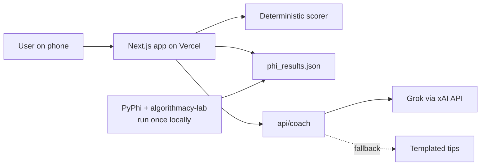
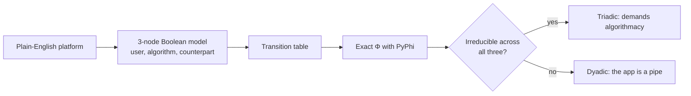

# Algorithmacy Coach

Algorithmacy Coach tells you two things about an app you use: whether the app's algorithm is a real third player between you and the people on the other side, and whether you are steering that algorithm or it is steering you.

A 60-second check. The score is a deterministic rubric. The structural verdict is exact Φ, precomputed with PyPhi.

Run it locally with `npm run dev` and open [http://127.0.0.1:43123](http://127.0.0.1:43123). A public Vercel URL is added here after the project is linked to a Vercel account.


## What it does

| Reading | Question | Source |
|---|---|---|
| Structure (Triad Check) | Are you inside this model's tangle? | Φ on the variant picked by questions 4 and 6 |
| Competence (Coach score) | Do you have it? | Six-question prototype rubric |

## Riya and Sam

Same platform, same structural verdict, different people.

| | Riya | Sam |
|---|---|---|
| Answers | 0, 0, 0, 0, 1, 0 | 2, 2, 2, 2, 1, 2 |
| Score | 1/12 Passive | 11/12 Deliberate |
| Platform | Instagram | Instagram |


## Architecture



Grok writes the headline, explanation, and tips. The score never depends on the model. If the key is missing, the call fails, or it takes longer than 8 seconds, the same screen fills from templated tips.

## How the Triad Check works



The verdict is the lab's own classifier: Φ over the minimum-information partition (`org_frontier.classifier.classify_rules`). Triadic when max Φ_MIP > 1e-9, otherwise dyadic. Numbers below are whatever that run wrote into `public/data/phi_results.json`. They are not edited by hand.

The instrument control (`python -m org_frontier.classifier.validate`, the core check in `ci/reproduce.json`) passed before these values were written. See `phi/instrument_control.txt`.

The three bases, before either switch:

| Platform | U (user) | A (algorithm) | C (counterpart) | Rules | Verdict | Φ |
|---|---|---|---|---|---|---|
| Instagram | creator posts | feed ranker | audience | A'=U AND C; U'=A; C'=A | triadic | 2 |
| Uber | driver goes online | dispatch | rider | A'=U AND C; U'=A; C'=A AND U | triadic | 1 |
| Email (comparison) | sender | mail server | recipient | A'=U; C'=A; U'=U | dyadic | 0 |

Email stays the forward-only chain from the lab's back-edge thread: the sender holds its own state and does not read the recipient. That base is what the switches edit.

Two switches, applied on top of each base, make twelve models. Keys are `platform:adapts:alternatives`.

- Adapts is question 4 scored 1 or 2. If not, `U' = U`: the user ignores the algorithm. If so, U keeps the base rule.
- Alternatives is question 6 scored 2. If so, `C' = (base rule for C) OR U`: a direct channel from the user to the counterpart. If not, C keeps the base rule.

The results screen looks up that key. If U is in the major complex it says "You are part of the tangle". If not, "You sit outside the tangle". Φ is the classifier's max Φ_MIP for that variant. None of these numbers were typed in by hand.

| Key | Rules | Verdict | Φ | Major complex | U in it |
|---|---|---|---|---|---|
| `instagram:false:false` | A'=U AND C; U'=U; C'=A | dyadic | 0 | A, C | no |
| `instagram:false:true` | A'=U AND C; U'=U; C'=(A) OR U | dyadic | 0 | U | yes |
| `instagram:true:false` | A'=U AND C; U'=A; C'=A | triadic | 2 | U, A, C | yes |
| `instagram:true:true` | A'=U AND C; U'=A; C'=(A) OR U | triadic | 0.41503749927884376 | U, A | yes |
| `uber:false:false` | A'=U AND C; U'=U; C'=A AND U | dyadic | 0 | A, C | no |
| `uber:false:true` | A'=U AND C; U'=U; C'=(A AND U) OR U | dyadic | 0 | U | yes |
| `uber:true:false` | A'=U AND C; U'=A; C'=A AND U | triadic | 1 | A, C | no |
| `uber:true:true` | A'=U AND C; U'=A; C'=(A AND U) OR U | triadic | 2 | U, A | yes |
| `email:false:false` | A'=U; U'=U; C'=A | dyadic | 0 | U | yes |
| `email:false:true` | A'=U; U'=U; C'=(A) OR U | dyadic | 0 | U | yes |
| `email:true:false` | A'=U; U'=U; C'=A | dyadic | 0 | U | yes |
| `email:true:true` | A'=U; U'=U; C'=(A) OR U | dyadic | 0 | U | yes |

Email's base already sets `U' = U`, so the adapts switch does not change its user rule. All four email variants stay dyadic at Φ 0, and the major complex is only U, so the card says you are part of the tangle even though the three-node system factors. Uber with adapts on and alternatives off is triadic at Φ 1, and U is not in the major complex (A, C): the system is irreducible and you still sit outside it.

```json
{
  "variants": {
    "instagram:false:false": {
      "phi": 0.0,
      "verdict": "dyadic",
      "major_complex": ["A", "C"],
      "u_in_major_complex": false,
      "rules": "A'=U AND C; U'=U; C'=A"
    }
  }
}
```

## Scoring rubric

Each answer scores 0 (passive), 1 (mixed), or 2 (deliberate). Total 0–12. Levels: 0–4 Passive, 5–8 Aware, 9–12 Deliberate.

| # | Theme | 0 | 1 | 2 |
|---|---|---|---|---|
| 1 | Discovery | I just take what {app} shows me | A mix of feed and my own choices | I mostly search or go to things I picked |
| 2 | Understanding | No idea why things show up | A rough idea | I can name the signals it uses |
| 3 | Tuning | I never adjust anything | Sometimes | I regularly mute, hide or reset |
| 4 | Adapting | I never change how I act for it | Sometimes, without a plan | I test times, formats or zones on purpose |
| 5 | Noticing | I don't notice being steered | Occasionally | I notice and decide whether to go along |
| 6 | Alternatives | {app} is my only channel to {counterpart} | I use one other channel a bit | I keep real alternatives to reach {counterpart} |

Question 6 echoes the lab's finding that a genuine substitute loosens a platform's hold.

## Run locally

```bash
npm install
cp .env.example .env.local   # XAI_API_KEY is optional; XAI_MODEL defaults to grok-4.7
npm run dev                  # http://127.0.0.1:43123
```

Rerun the structural verdicts, after the lab checkout and the PyPhi venv described in `PLAN.md`:

```bash
phi/.venv/bin/python phi/precompute_phi.py
```

`phi/vendor` and `phi/.venv` are gitignored. The script refuses to write trusted verdicts if the instrument control fails.

## Built with

Grok (xAI), Grok Bot in Cursor, PyPhi, [algorithmacy-lab](https://github.com/rogerSuperBuilderAlpha/algorithmacy-lab), Next.js, Vercel.

## Credits

Inspired by Roger Hunt's algorithmacy research. Structural verdicts are computed with PyPhi (IIT 4.0) via the open algorithmacy-lab repo, on simplified three-party models of each platform.

The coach score is a prototype rubric, not a validated measure.

Your answers are not stored.

## License

MIT. algorithmacy-lab is also MIT; this project uses its classifier and does not vendor the lab into the deploy.
