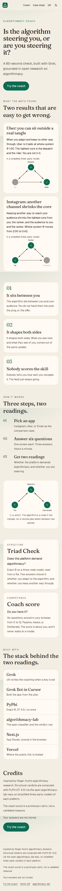
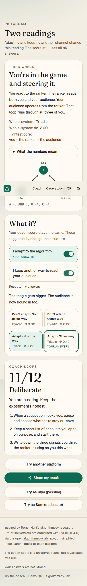
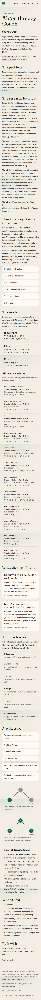
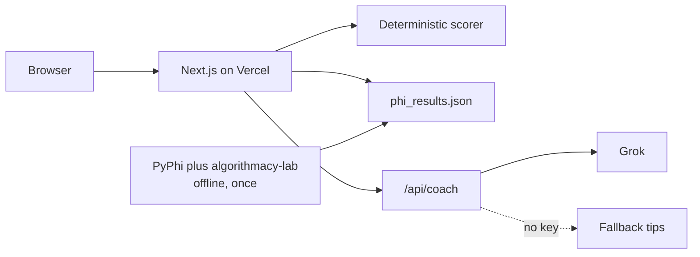
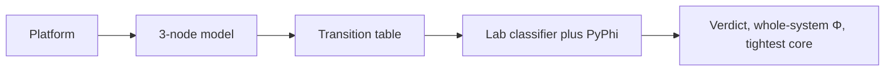
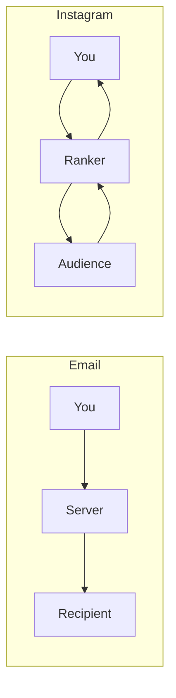
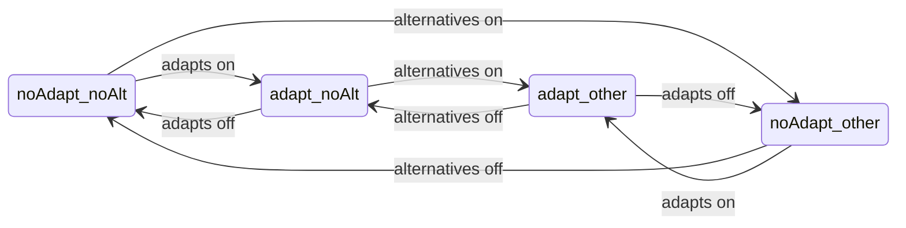
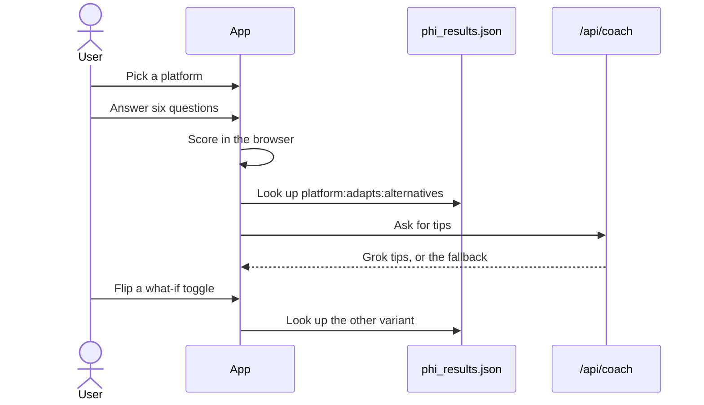

# Algorithmacy Coach

A one-minute check: is this app a pipe or a third player, and are you steering it?

Live: [algorithmacy-coach-in4yqz6rd-hari-eaa7.vercel.app](https://algorithmacy-coach-in4yqz6rd-hari-eaa7.vercel.app)


## What it does

| Reading | Question | Source |
|---|---|---|
| Structure (Triad Check) | Is there a tangle, and are you in its tightest core? | Whole-system Φ on the variant picked by questions 4 and 6 |
| Competence (Coach score) | Are you steering? | Six-question prototype rubric, scored in the browser |

## Screenshots








## What the math found

<!-- FINDINGS:START -->
- **Uber: you can sit outside a real tangle.** When you adapt and keep no other way through, Uber is triadic at whole-system Φ 1.00. The tightest core is the dispatch and the rider. You are not in it. Caveat: in a simplified three-party model.
- **Instagram: another channel shrinks the core.** Keeping another way to reach your audience shrinks the tightest core from you, the ranker, and the audience to you and the ranker. Whole-system Φ moves from 2.00 to 0.42. Caveat: in a simplified three-party model.
<!-- FINDINGS:END -->

## The research

Roger Hunt's [algorithmacy-lab](https://github.com/rogerSuperBuilderAlpha/algorithmacy-lab) asks whether a worker, a mediating system, and a counterpart form an irreducible whole. Dyadic coordination factors into independent pieces and needs ordinary literacy. Triadic coordination stays irreducible across those three parties and needs algorithmacy. The lab measures that with exact Φ (IIT 4.0, PyPhi), fixes hypotheses before computing, reports nulls, and asks for real-world data. The lab is MIT licensed. The full walkthrough is the [case study](https://algorithmacy-coach-in4yqz6rd-hari-eaa7.vercel.app/about).

## Diagrams

### Architecture



### Triad Check pipeline



### Pipe vs third player



### Four variants



### User flow



## Models and results

<!-- RESULTS:START -->
Base models, from `phi_results.json`:

| Platform | Rules | Verdict | Whole-system Φ |
|---|---|---|---|
| Instagram | A'=U AND C; U'=A; C'=A | triadic | 2.00 |
| Uber | A'=U AND C; U'=A; C'=A AND U | triadic | 1.00 |
| Email (comparison) | A'=U; C'=A; U'=U | dyadic | 0.00 |

Switches: Q4 score >= 1 keeps the base rule for U; otherwise U'=U Q6 score == 2 sets C' = (base C) OR U; otherwise the base rule for C

| Key | Rules | Verdict | Whole-system Φ | Tightest core |
|---|---|---|---|---|
| `instagram:false:false` | A'=U AND C; U'=U; C'=A | dyadic | 0.00 | the ranker and the audience |
| `instagram:false:true` | A'=U AND C; U'=U; C'=(A) OR U | dyadic | 0.00 | you |
| `instagram:true:false` | A'=U AND C; U'=A; C'=A | triadic | 2.00 | you, the ranker, and the audience |
| `instagram:true:true` | A'=U AND C; U'=A; C'=(A) OR U | triadic | 0.42 | you and the ranker |
| `uber:false:false` | A'=U AND C; U'=U; C'=A AND U | dyadic | 0.00 | the dispatch and the rider |
| `uber:false:true` | A'=U AND C; U'=U; C'=(A AND U) OR U | dyadic | 0.00 | you |
| `uber:true:false` | A'=U AND C; U'=A; C'=A AND U | triadic | 1.00 | the dispatch and the rider |
| `uber:true:true` | A'=U AND C; U'=A; C'=(A AND U) OR U | triadic | 2.00 | you and the dispatch |
| `email:false:false` | A'=U; U'=U; C'=A | dyadic | 0.00 | you |
| `email:false:true` | A'=U; U'=U; C'=(A) OR U | dyadic | 0.00 | you |
| `email:true:false` | A'=U; U'=U; C'=A | dyadic | 0.00 | you |
| `email:true:true` | A'=U; U'=U; C'=(A) OR U | dyadic | 0.00 | you |
<!-- RESULTS:END -->

## Scoring rubric

Each answer scores 0 (passive), 1 (mixed), or 2 (deliberate). Total 0–12. Levels: 0–4 Passive, 5–8 Aware, 9–12 Deliberate. This is a prototype rubric, not a validated measure.

| # | Theme | 0 | 1 | 2 |
|---|---|---|---|---|
| 1 | Discovery | I just take what the app shows me | A mix of feed and my own choices | I mostly search or go to things I picked |
| 2 | Understanding | No idea why things show up | A rough idea | I can name the signals it uses |
| 3 | Tuning | I never adjust anything | Sometimes | I regularly mute, hide or reset |
| 4 | Adapting | I never change how I act for it | Sometimes, without a plan | I test times, formats or zones on purpose |
| 5 | Noticing | I don't notice being steered | Occasionally | I notice and decide whether to go along |
| 6 | Alternatives | This app is my only channel | I use one other channel a bit | I keep real alternatives |

## Run locally

```bash
npm install
cp .env.example .env.local   # XAI_API_KEY is optional; XAI_MODEL defaults to grok-4.7
npm run dev                  # http://127.0.0.1:43123
npm test
npm run build
npm run docs                 # regenerate the results tables in this file
```

The fallback tips work with no `XAI_API_KEY`.

Rerun the structural verdicts with Python 3.10+ after the lab checkout and the PyPhi venv described in `PLAN.md`:

```bash
phi/.venv/bin/python phi/precompute_phi.py
```

`phi/vendor` and `phi/.venv` are gitignored. The script refuses to write trusted verdicts if the instrument control fails. Do not type Φ values by hand.

## Honest limitations

- The platforms are simplified three-node binary models. Each party is on or off.
- The numbers describe those models. They are not measurements of Instagram, Uber, or anyone's inbox.
- The coach score is a prototype rubric. It is not a validated measure.
- Φ is precomputed. Nothing calls PyPhi while you click.
- Tips are pre-written when no `XAI_API_KEY` is set. Grok does not choose the score or the verdict.

## Credits and license

Inspired by Roger Hunt's algorithmacy research. Structural verdicts are computed with PyPhi (IIT 4.0) via [algorithmacy-lab](https://github.com/rogerSuperBuilderAlpha/algorithmacy-lab), which is MIT licensed.

This project is MIT. Your answers are not stored.
